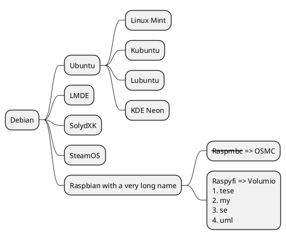
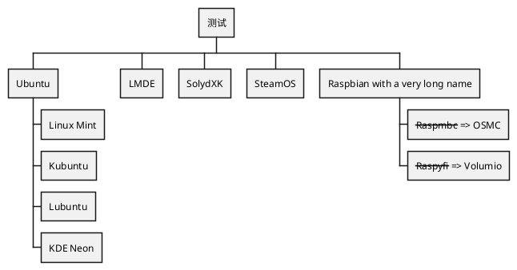
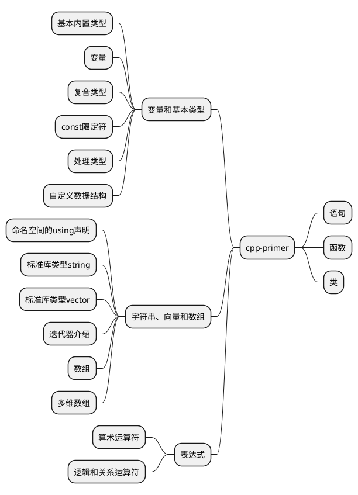

# /ch0(vim)/se0(myvim)
## /bl0(基础知识)
+ VIM有四个模式：<c1>正常模式 (Normal-mode) ，插入模式 (Insert-mode) ，命令模式 (Command-mode) ，可视模式 (Visual-mode)。</c>
+ 正常模式一般用于<c1>浏览文件</c>，也包括一些<c1>复制、粘贴、删除</c>等操作。这时击键时，一些组合键就是 vim 的<c1>功能键</c>，而不会在文本中键入对应的字符。
+ 在正常模式中按下个别字母键，会进入插入模式。插入模式启动以后，就会进入<c1>编辑状态</c>，通过键盘<c1>输入内容</c>。
+ 在正常模式中，按下<c1>：（冒号）键或者/ （斜杠）</c>，会进入命令模式。在命令模式中可以执行一些输入并执行一些 VIM 或插件提供的指令，就像在shell里一样。这些指令包括设置环境、文件操作、调用某个功能等等。
+ 在正常模式按下<c1>v, V, <Ctrl>+v</c>，可以进入可视模式。可视模式中的操作有点像拿鼠标进行操作，选择文本的时候有一种鼠标选择的即视感，有时候会很方便。
+ <c1>This </c><c2>text!</c><c3> some </c><c4>is </c>
## /bl1(正常模式下光标的移动)
+ 在正常模式下，可以通过键盘在文本中快速移动光标，光标范围从小到大是<c1>字符、单词、行、句子、段落和屏幕</c>。
+ <c2>光标单步移动</c>：<c1>h</c>-<c2>左</c>，<c1>j</c>-<c2>下</c>，<c1>k</c>-<c2>上</c>，<c1>l</c>-<c2>右</c>。
+ <c2>光标在单词间移动</c>：<c1>e</c>-<c2>当前单词的词尾，向右跨单词</c>，<c1>b</c>-<c2>当前单词的词头，向左跨单词</c>，<c1>w</c>-<c2>下一个单词的词头，向右跨单词</c>。WORD:以空格分隔的大单词(实际上由好多单词组成),三个大写的词代表在大词间移动。
+ <c2>光标在行间移动</c>：<c1>0或^</c> - <c2>当前行的行头</c>，<c1>$</c>- <c2>当前行的行尾</c>。
+ <c2>光标在句子间移动</c>：<c1>(</c>-<c2>上一个句子的开头</c>，<c1>)</c>- <c2>下一个句子的开头</c>。
+ <c2>光标在段间移动，段落以空行作为分割</c>：<c1>{</c>- <c2>上一个段落</c>，<c1>}</c>- <c2>下一个段落</c>。
+ <c2>光标在块间(用大括号包裹的{})移动</c>：<c1>[{</c> - <c2>当前块的开头</c>，<c1>]}</c> - <c2>当前块的结尾</c>。
+ <c2>光标在屏幕中移动</c>：<c1>H</c>- <c2>屏幕最顶端的那一行</c>，<c1>M</c>- <c2>屏幕中间的那一行</c>，<c1>L</c> - <c2>屏幕底端的那一行</c>，<c1>gg</c> - <c2>文件的第一行</c>，<c1>G</c> - <c2>文件的最后一行</c>。
+ <c2>光标翻页</c>：<c1>ctrl+f</c>- <c2> 查看下一页内容</c>，<c1>ctrl+b</c> -  <c2>查看上一页内容</c>。

